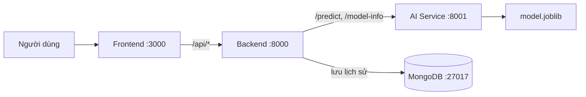

# California Housing Price Prediction

Ứng dụng dự đoán giá trung vị nhà ở tại California từ dữ liệu của một khu vực. Dự án gồm pipeline Machine Learning, AI Service, Backend, Frontend và MongoDB; các service được khởi chạy bằng Docker Compose.

## 1. Thành viên (họ tên, MSSV, phần việc)

- **Nguyễn Đức Minh — 10123224:** EDA, tiền xử lý dữ liệu, huấn luyện và so sánh model; AI Service, Backend, README và báo cáo.
- **Đào Chính Quang — 10123263:** lựa chọn dataset, PowerPoint, Frontend và kiểm thử hệ thống/API.

## 2. Bài toán (mô tả, loại bài toán, cột mục tiêu, ý nghĩa thực tế)

- **Mô tả:** ước lượng giá trị trung vị nhà ở tại một khu vực ở California từ đặc trưng địa lý, nhà ở, dân số và mức độ gần biển.
- **Loại bài toán:** Supervised Learning — Regression.
- **Cột mục tiêu:** `median_house_value`.
- **Ý nghĩa thực tế:** cung cấp giá trị tham khảo từ dữ liệu khu vực; kết quả không thay thế việc định giá chuyên môn.

Model nhận 9 đặc trưng thô. Pipeline tạo thêm các đặc trưng `rooms_per_household`, `bedrooms_per_room` và `population_per_household` trong quá trình dự đoán.

## 3. Dữ liệu (link Kaggle, giấy phép, mô tả cột, cách giải nén dataset.zip)

- **Dataset:** California Housing, 20.640 dòng và 10 cột.
- **Nguồn:** [California Housing Prices — Kaggle](https://www.kaggle.com/datasets/camnugent/california-housing-prices).
- **Giấy phép được ghi nhận:** [CC0 1.0 Universal](https://creativecommons.org/publicdomain/zero/1.0/); xem thêm [`DATA.md`](ai-models/data/DATA.md).
- **File trong repository:** `ai-models/data/housing.csv.zip`. Notebook đọc trực tiếp CSV bên trong ZIP, không bắt buộc giải nén để chạy.

| Cột | Kiểu | Mô tả / vai trò |
|---|---|---|
| `longitude` | Số | Kinh độ khu vực — input. |
| `latitude` | Số | Vĩ độ khu vực — input. |
| `housing_median_age` | Số | Tuổi trung vị nhà ở trong khu vực — input. |
| `total_rooms` | Số | Tổng số phòng — input. |
| `total_bedrooms` | Số | Tổng số phòng ngủ — input; có giá trị thiếu trong dataset. |
| `population` | Số | Dân số khu vực — input. |
| `households` | Số | Số hộ gia đình — input. |
| `median_income` | Số | Thu nhập trung vị theo đơn vị của dataset — input. |
| `ocean_proximity` | Category | Nhóm vị trí tương đối với biển/vịnh — input. |
| `median_house_value` | Số | Giá trị trung vị nhà ở — target. |

**Giải nén tùy chọn**

Windows PowerShell:

```powershell
Expand-Archive -LiteralPath .\ai-models\data\housing.csv.zip -DestinationPath .\ai-models\data\extracted
```

macOS/Linux hoặc Python:

```bash
python -m zipfile -e ai-models/data/housing.csv.zip ai-models/data/extracted
```

## 4. Kết quả model (bảng so sánh metric, model được chọn và lý do)

Bảng dưới đây là kết quả đã lưu trong `03_train.ipynb`, không phải metric của artifact đang được API nạp. RMSE và MAE càng thấp càng tốt; R² càng cao càng tốt.

| Model | CV RMSE (USD) | Test RMSE (USD) | Test MAE (USD) | Test R² |
|---|---:|---:|---:|---:|
| Linear Regression (baseline) | — | 69,127.04 | 49,645.49 | 0.6353 |
| Decision Tree | 60,506.68 | 60,797.85 | 39,990.45 | 0.7179 |
| Random Forest | 50,270.72 | 49,697.39 | 31,942.22 | 0.8115 |
| Gradient Boosting | 47,251.39 | 46,387.57 | 30,251.96 | 0.8358 |

**Model được chọn:** Gradient Boosting có CV RMSE và Test RMSE thấp nhất, đồng thời Test R² cao nhất trong bảng trên. Đây là lý do chọn model cho artifact. Các số dưới đây là từ metadata của artifact đang chạy, nên khác với snapshot notebook:

- Phiên bản: `2.0.0`
- Test RMSE: `46,794.54` USD
- Test MAE: `30,649.37` USD
- Test R²: `0.8329`
- CV RMSE: `47,251.39` USD

## 5. Đóng gói model (đường dẫn file model trong repo, cách export từ Colab)

Các artifact dùng bởi ứng dụng:

- `ai-models/models/model.joblib` — pipeline tiền xử lý và model đã huấn luyện.
- `ai-models/models/metadata.json` — version, hyperparameter, metric và phiên bản thư viện.
- `ai-models/models/schema.json` — tên feature, kiểu dữ liệu, khoảng số và giá trị category hợp lệ.

AI Service nạp `model.joblib` khi khởi động container. Để tạo lại artifact trong repository, chạy notebook `04_evaluate.ipynb` theo thứ tự ở mục 8; cell đóng gói ghi pipeline vào `ai-models/models/model.joblib` và tạo metadata/schema tương ứng. Sau khi chạy trên Colab, tải/copy đủ ba file trên về đúng thư mục `ai-models/models/` trong repository.

Artifact hiện tại được tạo với Python 3.12; các phiên bản được ghi trong metadata: scikit-learn `1.6.1`, pandas `2.2.3`, NumPy `2.1.3`, joblib `1.6.0`. Khi thay model, cần giữ các file artifact đồng bộ và dùng phiên bản thư viện tương thích.

## 6. Kiến trúc hệ thống (sơ đồ FE - BE - AI - DB)



- **Frontend:** hiển thị form theo schema và proxy API request tới Backend.
- **Backend:** kiểm tra dữ liệu, gọi AI Service, trả kết quả và lưu/lấy lịch sử.
- **AI Service:** nạp pipeline/model, cung cấp dự đoán, health và model metadata.
- **MongoDB:** lưu prediction history.

Trong Docker, các service gọi nhau qua tên service (`backend`, `ai-service`, `mongodb`). Frontend không gọi trực tiếp AI Service. Các API không yêu cầu đăng nhập.

## 7. Chạy trên máy (yêu cầu: Docker; lệnh: cp .env.example .env; docker compose up --build)

Yêu cầu: Git, Docker và Docker Compose.

```bash
git clone https://github.com/MinhNguyen0106/cali-house-price-prediction.git
cd cali-house-price-prediction
cp .env.example .env
docker compose up --build
```

Windows PowerShell, thay lệnh copy file bằng:

```powershell
Copy-Item .env.example .env
```

Đợi các container khởi động, sau đó mở:

- Frontend: <http://localhost:3000>
- Backend Swagger: <http://localhost:8000/docs>
- AI Service Swagger: <http://localhost:8001/docs>

Kiểm tra container và health:

```bash
docker compose ps
curl http://localhost:3000/health
curl http://localhost:8000/health
curl http://localhost:8001/health
```

Trên Windows có thể dùng `curl.exe`. Dừng các service bằng `docker compose down`; dữ liệu MongoDB được giữ trong volume. Chỉ dùng `docker compose down -v` nếu muốn xóa cả volume dữ liệu.

## 8. Huấn luyện lại model (link Colab, thứ tự chạy notebook)

Notebook chạy theo thứ tự:

1. `ai-models/colab/01_eda.ipynb` — khám phá dữ liệu.
2. `ai-models/colab/02_preprocess.ipynb` — tiền xử lý và chia tập dữ liệu.
3. `ai-models/colab/03_train.ipynb` — huấn luyện và so sánh các model.
4. `ai-models/colab/04_evaluate.ipynb` — đánh giá, phân tích residual và lưu artifact.

**Google Colab:** [Mở notebook Colab của dự án](https://colab.research.google.com/drive/1EI8srM9o6fLENsqM_NcGlXfgABVZdJYT?hl=vi).

Các notebook tìm `ai-models/data/housing.csv.zip` và đọc CSV bên trong. Khi chạy trên Colab, cần đưa/clone repository vào runtime để notebook truy cập được dataset. Có thể huấn luyện bằng source Python thay cho notebook:

```bash
python -m pip install -r ai-models/requirements.txt
python ai-models/src/evaluate.py
```

Lệnh `evaluate.py` huấn luyện lại và cập nhật artifacts trong `ai-models/models/`; không cần chạy để dùng model hiện tại.

## 9. Biến môi trường (bảng từng biến, ý nghĩa)

Giá trị mặc định dưới đây được lấy từ `.env.example`, `docker-compose.yml` và cấu hình service. Các URL nội bộ Docker cần dùng service name, không đổi thành `localhost` khi chạy trong container.

| Biến | Mặc định | Ý nghĩa |
|---|---|---|
| `AI_SERVICE_URL` | `http://ai-service:8001` | Backend gọi AI Service. |
| `AI_SERVICE_TIMEOUT_SECONDS` | `30` | Thời gian chờ Backend gọi AI Service. |
| `BACKEND_URL` | `http://backend:8000` | Frontend proxy gọi Backend. |
| `BACKEND_TIMEOUT_SECONDS` | `30` | Thời gian chờ Frontend gọi Backend. |
| `API_URL` | `/` | Base URL API của trình duyệt; `/` dùng cùng host Frontend. |
| `FRONTEND_PORT` | `3000` | Cổng Frontend publish ra máy host. |
| `BACKEND_PORT` | `8000` | Cổng Backend publish ra máy host. |
| `AI_SERVICE_PORT` | `8001` | Cổng AI Service publish ra máy host. |
| `MODEL_PATH` | `/app/models/model.joblib` | Đường dẫn model trong container AI. |
| `MODEL_METADATA_PATH` | `/app/models/metadata.json` | Đường dẫn metadata trong container AI. |
| `MODEL_SCHEMA_PATH` | `/app/models/schema.json` | Đường dẫn schema trong container. |
| `MONGODB_URI` | `mongodb://mongodb:27017` | URI kết nối MongoDB từ Backend. |
| `MONGODB_DATABASE` | `cali_house_db` | Database lưu prediction history. |
| `MONGODB_COLLECTION` | `predictions` | Collection lưu prediction history. |
| `CORS_ORIGINS` | `localhost` và `127.0.0.1`, ports 3000/8000 | Danh sách origin được phép, phân tách bằng dấu phẩy. |
| `PORT` | Được Compose đặt lần lượt là `3000`, `8000`, `8001` | Cổng Uvicorn trong từng container; thông thường không cần khai báo thủ công trong `.env`. |

`MODEL_SCHEMA_PATH` được Compose cấu hình cho cả AI Service và Backend. AI Service cũng dùng `MODEL_PATH` và `MODEL_METADATA_PATH`. Public URL ngrok không phải URL nội bộ giữa các container; khi dùng `API_URL=/`, URL tunnel đổi không yêu cầu thay `BACKEND_URL` hay `AI_SERVICE_URL`.

## 10. Triển khai (cách public: deploy/tunnel, các bước, cách cập nhật khi đổi link)

Hiện ứng dụng được public bằng ngrok tunnel tới Frontend local trên cổng `3000`; đây là cách public tạm thời, không phải hosting luôn sẵn sàng.

1. Tạo `.env` và khởi động stack: `docker compose up --build -d`.
2. Kiểm tra `docker compose ps` và mở `http://localhost:3000/health`.
3. Mở một terminal khác và chạy:

   ```bash
   ngrok http 3000
   ```

4. Lấy HTTPS Forwarding URL do ngrok hiển thị. Không dùng URL ví dụ hoặc URL cũ nếu ngrok đã cấp domain khác.
5. Kiểm tra URL public bằng `/health`, sau đó thực hiện dự đoán qua `/api/predict` và kiểm tra `/api/history`.
6. Khi URL thay đổi, cập nhật địa chỉ App ở mục 11 và ghi nhận URL cũ/mới, thời điểm ghi nhận ở mục 12. Nếu dùng `API_URL=/`, Frontend gọi API tương đối cùng host; không đưa URL tunnel vào `BACKEND_URL` hoặc `AI_SERVICE_URL`.

Tunnel chỉ truy cập được khi máy host, Docker containers và tiến trình ngrok đang chạy. URL miễn phí có thể thay đổi sau khi khởi động lại ngrok. Để public riêng Backend hoặc AI Service cần cấu hình tunnel/deployment tương ứng; tunnel hiện tại chỉ forward tới Frontend.

## 11. Demo online (địa chỉ App, địa chỉ AI Service/docs — cập nhật mỗi khi đổi)

- **App / Frontend:** <https://applicant-underrate-psychic.ngrok-free.dev>
- **Backend API:** được gọi qua Frontend proxy tại `https://applicant-underrate-psychic.ngrok-free.dev/api/...`; chưa có URL public riêng được xác nhận.
- **AI Service API / Swagger:** chưa được public riêng qua ngrok hiện tại. Khi chạy local, Swagger ở <http://localhost:8001/docs> và API ở <http://localhost:8001>.
- **Kết quả kiểm tra ngày 02/10/2026:** public `/health` trả HTTP 200; public `/api/predict` trả prediction thành công với model version `2.0.0`.

URL ngrok là địa chỉ tại lần kiểm tra nêu trên; cần kiểm tra lại khi sử dụng vì tunnel có thể đổi hoặc ngừng khi máy host tắt.

## 12. Nhật ký đổi cổng/tunnel (thời điểm đổi, địa chỉ cũ → mới)

Repository chưa có dữ liệu xác nhận thời điểm tạo/đổi URL trước đây. Không suy ra ngày đổi tunnel từ ngày kiểm tra.

| Thời điểm | Địa chỉ cũ | Địa chỉ mới | Ghi chú |
|---|---|---|---|
| Chưa được ghi nhận | Không có dữ liệu | `https://applicant-underrate-psychic.ngrok-free.dev` | URL đã kiểm tra hoạt động ngày 02/10/2026; đây là mốc kiểm thử, không khẳng định ngày đổi URL. |

Khi ngrok cấp URL mới, thay địa chỉ hiện hành tại mục 11 và cập nhật thêm một dòng với thời điểm đổi thực tế.

## 13. Kết quả kiểm thử hiệu năng

Chưa có API load test được ghi nhận trong repository. Vì vậy, throughput, latency trung bình/percentile và error rate dưới tải **chưa được đo**; không dùng thời gian inference trong notebook làm benchmark API.

## 14. Hạn chế và hướng phát triển

**Hạn chế hiện tại**

- `median_house_value` trong dataset bị giới hạn ở mức 500.000 USD; kết quả ở vùng giá cao cần được diễn giải thận trọng.
- Ngrok phụ thuộc máy cá nhân và không bảo đảm URL cố định hoặc dịch vụ hoạt động liên tục.
- Chưa có load test API để đánh giá khả năng chịu tải.
- API chưa có authentication/authorization.
- Prediction history phụ thuộc MongoDB. Nếu lưu history lỗi, Backend có thể vẫn trả prediction thành công và ghi lỗi vào log.
- Metric notebook và metric artifact phản ánh các lần huấn luyện khác nhau; dùng `metadata.json` làm nguồn metric cho model đang chạy.

**Hướng phát triển**

- Thêm benchmark có thể chạy lại, ghi nhận số request, throughput, latency và error rate.
- Chuyển sang hosting ổn định hơn nếu cần demo liên tục; cập nhật URL và nhật ký triển khai.
- Cân nhắc authentication/authorization nếu đưa ứng dụng ra sử dụng rộng hơn.
- Đồng bộ báo cáo/slide với metadata của artifact được phát hành.
